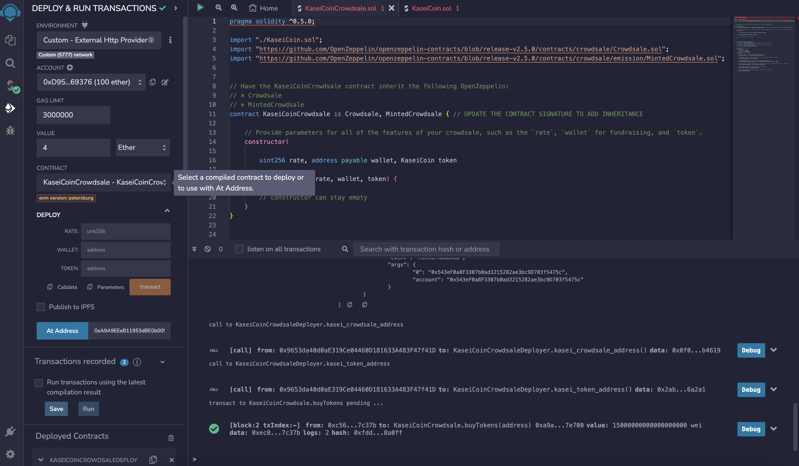

# KaseiCoin

The objective of this excercise is to use blockchain technology to define a new cryptocurrency named KaseiCoin. KaseCoin is created as fungible token that’s ERC-20 compliant. It launches a crowdsale that will allow people to convert their money to KaseiCoin.

It is important to note I did not use MetaMask as we did not cover it in class.

## Libraries and Dependencies 
1) Solidity
2) Remix IDE
3) Ganache

## Steps 
1) Create the KaseiCoin Token Contract
2) Create the KaseiCoin Crowdsale Contract
3) Create the KaseiCoin Deployer Contract
4) Deploy and Test the Crowdsale on a Local Blockchain

## Evaluation Evidence
1) KaseiCoin Token Contract-  successful compilation. 
 
2) KaseiCoin Crowdsale Contract- successful compilation. 
 
3) KaseiCoin Deployer Contract- successful compilation. 
 
4) Deploy and Test the Crowdsale. 
  Deploy KaseiCoin Deployer Contract with Ganache account: 
   
  Ganache Results: 
   
   
   
  Deploy KaseiCoin Token Contract with Ganache account: 
   
   
  Deploy KaseiCoin Crowdsale Contract with Ganache account: 
   
   
5) Buy Tokens. 
  First Token:  
   
   
   
   
    
  Second Token:  
   
   
   
   
   
